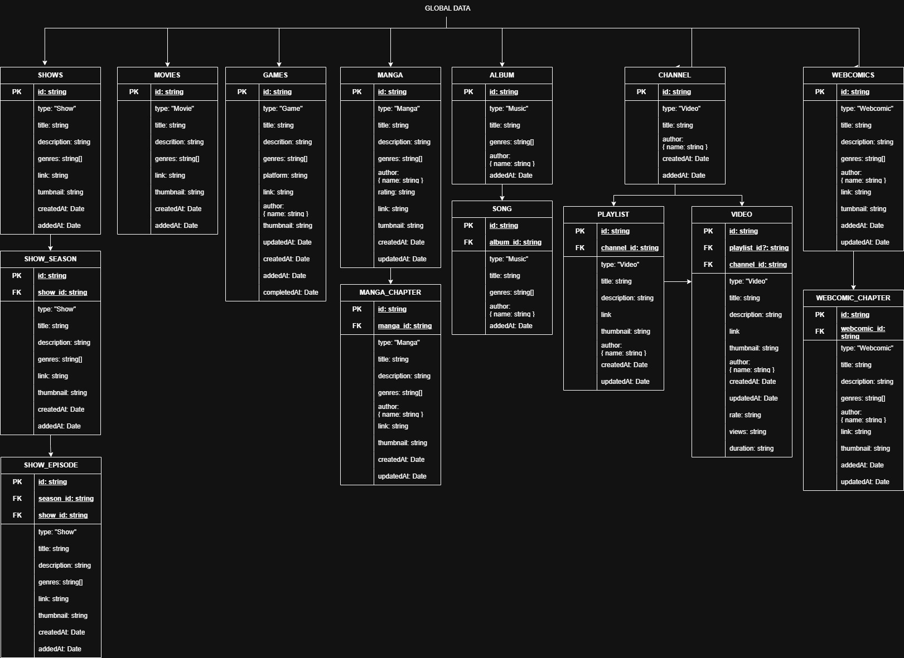

# Personal site

This is the source code of my website, accessible at:

- https://kulugary.neocities.org/

Made using Eleventy and Nunjucks.

## Data structure

This site makes use of [Eleventy's global data files](https://www.11ty.dev/docs/data-global/) to populate the site's `media` pages. It makes use of `webscrapping` and `fetching` different sites/APIs -and in some cases, local files -to retrieve data.
